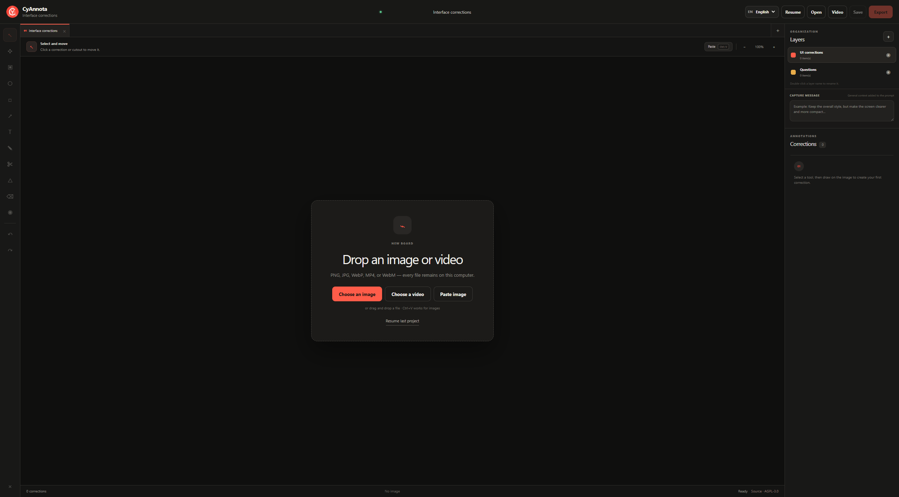

# CyAnnota

<p align="center"></p>

CyAnnota est un outil local d’annotation d’images, de vidéos et de modèles 3D. Il permet de préparer des retours visuels, de collaborer en équipe, de créer des arrêts sur image, de peindre des indications sur des meshes et d’exporter les annotations pour une personne ou une IA dans des projets réouvrables au format `.cyannota`.

> **Bêta :** CyAnnota est encore en développement. Certaines fonctionnalités peuvent évoluer ou contenir des bugs.

## Aperçus

### Accueil et import des médias



## Fonctions principales

- annotations d’images avec cadres, formes, textes, couleurs, suppressions et découpes ;
- annotations vidéo et GIF temporelles, avec arrêts sur image précis ;
- annotations 3D par peinture indicative sur le mesh : modification, suppression, changement de couleur ou séparation ;
- import GLB/glTF et conversion locale FBX, OBJ, USD, USDA, USDC et USDZ vers GLB, sans envoi vers un serveur ;
- vues caméra enregistrées relativement au modèle ou au mesh annoté, avec captures incluses dans le projet ;
- import par fichier, glisser-déposer ou `Ctrl+V` pour les images, vidéos et GIF ;
- zoom et déplacement dans un espace de travail de type canvas ;
- sauvegarde de plusieurs médias dans un projet `.cyannota` ;
- exports Humain sans prompt et exports IA avec prompts structurés ;
- export GIF ou MP4, optimisation locale des images en WebP, copie du fichier exporté dans le presse-papiers et renommage automatique sans écrasement ;
- intégration locale avec CyTask, CyCapture, CyAIOrchestrator et des applications Web : éditeur embarqué, envoi direct, lecture du paquet et miniature ;
- SDK AI authoring pour créer ou modifier des projets `.cyannota` avec des annotations spatiales et temporelles structurées ;
- application Web locale et application Windows Electron ;
- interface et prompts en anglais ou en français, avec l’anglais par défaut.

Les fichiers `.blend` nécessitent Blender et doivent être exportés en GLB avant leur import dans CyAnnota.

## Développement

Prérequis : Node.js 22.13 ou plus récent.

```bash
npm install
npm run dev
```

Build Web :

```bash
npm run build
```

Build Windows portable et installeur :

```bash
npm run desktop:build
```

Le contrat d’intégration est décrit dans [`integrations/README.md`](integrations/README.md).

## Licence

Copyright (C) 2026 CyberAlien.

CyAnnota est distribué sous **GNU Affero General Public License v3.0 uniquement** (`AGPL-3.0-only`). Consultez [`LICENSE`](LICENSE).

Le SDK autonome [`public/cyannota-integration.js`](public/cyannota-integration.js) est distribué séparément sous licence MIT afin de permettre son intégration dans d’autres logiciels et sites.

Les composants tiers conservent leurs propres licences. Consultez [`THIRD_PARTY_NOTICES.md`](THIRD_PARTY_NOTICES.md), notamment pour FFmpeg et `@ffmpeg/core`.
